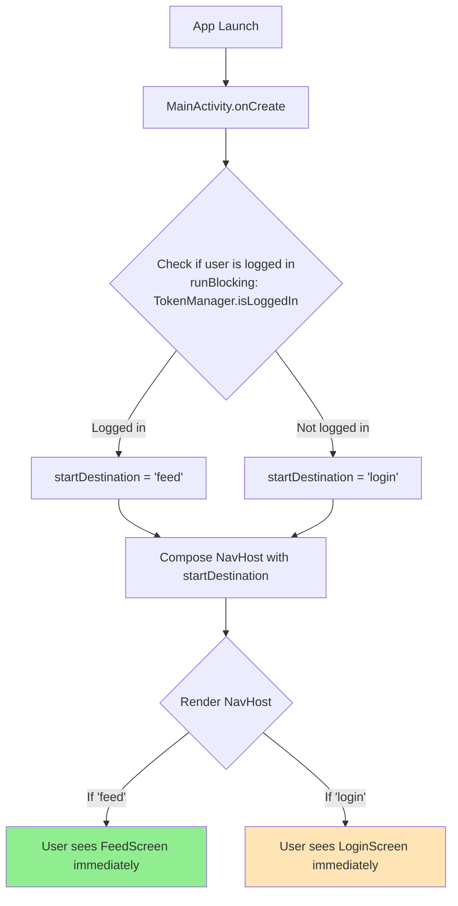
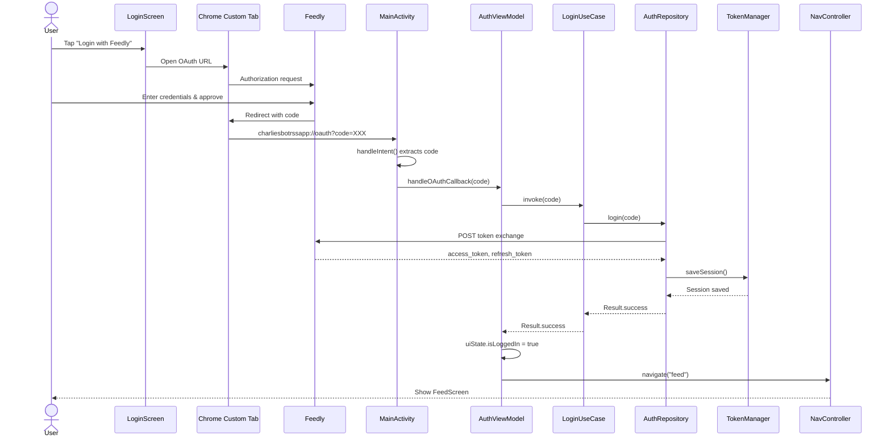
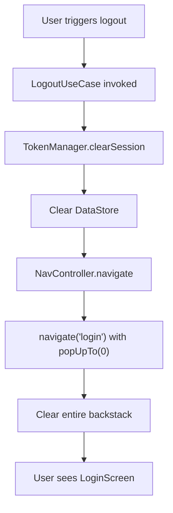

# Authentication Flow Design

## Overview

Authentication system using OAuth 2.0 with Feedly API, implemented with Jetpack Compose and Navigation Compose 2.

## Tech Stack

- **UI**: Jetpack Compose
- **Navigation**: Navigation Compose 2 (Jetpack Navigation)
- **State Management**: StateFlow + ViewModel
- **OAuth Provider**: Feedly API
- **Storage**: DataStore Preferences (TokenManager)
- **DI**: Koin

## OAuth Flow

### 1. Authorization Request

User initiates login from `LoginScreen`:

- App opens Chrome Custom Tab with Feedly OAuth URL
- URL format: `https://feedly.com/v3/auth/auth?response_type=code&client_id={CLIENT_ID}&redirect_uri={REDIRECT_URI}&scope={SCOPES}`
- Redirect URI: `charliesbotrssapp://oauth`

### 2. Authorization Callback

After user approves in Feedly:

- Chrome Custom Tab redirects to `charliesbotrssapp://oauth?code={AUTH_CODE}`
- Android intent filter catches the deep link
- `MainActivity.onNewIntent()` receives the callback
- Extract authorization code from URI query parameter

### 3. Token Exchange

`MainActivity` passes code to `AuthViewModel`:

- `AuthViewModel.handleOAuthCallback(code)` invoked
- Calls `LoginUseCase` which calls `AuthRepository`
- Repository makes POST to Feedly token endpoint with authorization code
- Receives: `{ access_token, refresh_token, expires_in, plan }`
- `TokenManager` persists session to DataStore

### 4. Session Management

`TokenManager` stores in DataStore:

- `access_token`: Bearer token for API requests
- `refresh_token`: Token for refreshing expired access tokens
- `expires_at`: Timestamp for token expiration
- `feedly_plan`: User's Feedly subscription plan

## Navigation Flow

### App Startup (Navigation 2)



### Login Flow



### Protected Routes

Navigation 2 uses **nested navigation graphs** for protected routes.

### How Nested Graphs Work

```kotlin
navigation(startDestination = Routes.FEED, route = Routes.AUTHENTICATED) {
    composable(Routes.FEED) { FeedScreen(navController) }
    composable(Routes.SETTINGS) { SettingsScreen(navController) }
}
```

- `Routes.AUTHENTICATED` is the **graph route** (parent)
- `Routes.FEED`, `Routes.SETTINGS` are **destination routes** (children)
- Navigating to `Routes.AUTHENTICATED` automatically starts at the `startDestination` (Feed)

### Navigation Behavior

**On App Startup:**

- If logged in: `startDestination = Routes.AUTHENTICATED` → Shows FeedScreen
- If not logged in: `startDestination = Routes.LOGIN` → Shows LoginScreen

**After OAuth Login:**

```kotlin
navController.navigate(Routes.AUTHENTICATED) {
    popUpTo(Routes.LOGIN) { inclusive = true }
}
```

- Navigates to authenticated graph (shows Feed)
- Removes Login from backstack

**On Logout:**

```kotlin
navController.navigate(Routes.LOGIN) {
    popUpTo(0) { inclusive = true }
}
```

- Clears entire backstack (removes all authenticated routes)
- Shows Login as only destination

### Logout Flow



## Component Responsibilities

### MainActivity

- **Check auth on startup** via `runBlocking { tokenManager.isLoggedIn() }`
- **Determine startDestination** before composing (`"login"` or `"feed"`)
- Handle OAuth deep link callbacks (`charliesbotrssapp://oauth`)
- Extract authorization code from URI
- Pass code to `AuthViewModel.handleOAuthCallback()`
- Set up Compose content with `NavHost`

### AuthViewModel

- Expose `AuthUiState` with `isLoggedIn`, `isLoading`, `errorMessage`
- `handleOAuthCallback(code)` - orchestrate token exchange
- Update UI state based on login result
- **Receives NavController** to trigger navigation after login success
- On success: `navController.navigate(Routes.AUTHENTICATED) { popUpTo(Routes.LOGIN) { inclusive = true } }`

### NavHost (Composable)

- Receives `navController` and `startDestination`
- Defines navigation graph with routes:
  - `"login"` → `LoginScreen`
  - `"feed"` → `FeedScreen`
- Renders appropriate screen based on current destination

### LoginScreen (Composable)

- Receives `navController` as parameter
- Display "Login with Feedly" button
- On click: open Chrome Custom Tab with OAuth URL
- Show loading state during token exchange
- Display error messages if login fails
- After successful login, `AuthViewModel` handles navigation

### TokenManager

- `saveSession(AuthSession)` - persist tokens to DataStore
- `getCurrentSession(): AuthSession?` - retrieve current session
- `clearSession()` - delete all tokens
- `isLoggedIn(): Boolean` - check if valid session exists

## Auth State Flow

### AuthViewModel.uiState

```kotlin
data class AuthUiState(
  val isLoading: Boolean = false,
  val isLoggedIn: Boolean = false,
  val errorMessage: String? = null
)
```

State transitions:

- **Initial**: `isLoggedIn = false, isLoading = false`
- **OAuth callback received**: `isLoading = true`
- **Login success**: `isLoggedIn = true, isLoading = false`
- **Login failure**: `isLoggedIn = false, isLoading = false, errorMessage = "..."`

## Token Refresh

(Future implementation)

- Before API calls, check if `access_token` is expired
- If expired, call `RefreshTokenUseCase`
- Make POST to Feedly refresh endpoint with `refresh_token`
- Update stored tokens
- Retry original API call

## Error Handling

### OAuth Errors

- User denies permission → show error in LoginScreen
- Network failure during token exchange → show retry option
- Invalid authorization code → show error message

### Session Errors

- Expired tokens → attempt refresh, fallback to logout
- Invalid/corrupted DataStore → clear session, navigate to login
- Revoked tokens → logout user, show message

## Security Considerations

- Store tokens in encrypted DataStore (consider using EncryptedSharedPreferences for higher security)
- Use HTTPS for all API calls
- Clear tokens completely on logout
- Handle token expiration gracefully
- Use PKCE (Proof Key for Code Exchange) if supported by Feedly API

## Feedly API Endpoints

### Authorization

- **URL**: `https://feedly.com/v3/auth/auth`
- **Params**: `response_type=code`, `client_id`, `redirect_uri`, `scope`

### Token Exchange

- **URL**: `https://feedly.com/v3/auth/token`
- **Method**: POST
- **Body**: `grant_type=authorization_code`, `code`, `client_id`, `client_secret`, `redirect_uri`
- **Response**: `{ access_token, refresh_token, expires_in, plan }`

### Token Refresh

- **URL**: `https://feedly.com/v3/auth/token`
- **Method**: POST
- **Body**: `grant_type=refresh_token`, `refresh_token`, `client_id`, `client_secret`
- **Response**: `{ access_token, expires_in }`

## Navigation 2 Integration

### Routes Definition

```kotlin
// String-based routes
object Routes {
    const val LOGIN = "login"
    const val FEED = "feed"
    const val AUTHENTICATED = "authenticated" // Nested graph for protected routes
}
```

### NavHost Setup

```kotlin
@Composable
fun AppNavigation(startDestination: String) {
    val navController = rememberNavController()

    NavHost(
        navController = navController,
        startDestination = startDestination
    ) {
        // Public route
        composable(Routes.LOGIN) {
            LoginScreen(navController)
        }

        // Protected routes (nested graph)
        navigation(startDestination = Routes.FEED, route = Routes.AUTHENTICATED) {
            composable(Routes.FEED) {
                FeedScreen(navController)
            }
            // Future protected routes
            // composable(Routes.SETTINGS) { SettingsScreen(navController) }
            // composable(Routes.PROFILE) { ProfileScreen(navController) }
        }
    }
}
```

### MainActivity Integration

```kotlin
class MainActivity : ComponentActivity() {
    private val tokenManager: TokenManager by inject()

    override fun onCreate(savedInstanceState: Bundle?) {
        super.onCreate(savedInstanceState)

        // Determine start destination BEFORE composing
        val startDestination = runBlocking {
            if (tokenManager.isLoggedIn()) Routes.AUTHENTICATED else Routes.LOGIN
        }

        setContent {
            AresTheme {
                AppNavigation(startDestination = startDestination)
            }
        }
    }
}
```

### Key Benefits

- **No flash**: Start destination determined before composition
- **Synchronous auth check**: `runBlocking` ensures startDestination is correct
- **Simple**: No custom BackStack wrapper, just standard NavController
- **Clean**: User sees correct screen immediately on launch
- **Scalable**: Nested graph pattern makes it easy to add more protected routes
- **Clear separation**: All authenticated routes are grouped under `Routes.AUTHENTICATED`

## Expected User Experience

### First Launch (Not Logged In)

1. App opens to Login screen
2. User taps "Login with Feedly"
3. Chrome Custom Tab opens with Feedly login
4. User enters credentials and approves
5. Redirects back to app
6. Brief loading indicator
7. Feed screen appears

### Subsequent Launches (Logged In)

1. App opens directly to Feed screen
2. No login required (session persists)

### Accessing Protected Route (Not Logged In)

1. User somehow navigates to protected route
2. App intercepts navigation
3. Redirects to Login screen
4. After login, navigates to originally intended route

### Logout

1. User taps logout
2. Tokens cleared from storage
3. Navigates to Login screen
4. All protected routes removed from back stack
